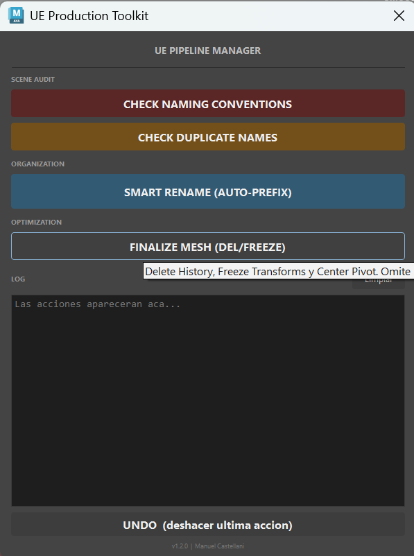

# 🛠️ UE Production Toolkit

**Herramienta de pipeline Maya → Unreal Engine que aplica convenciones de nombres, valida escenas y limpia geometría — para que cada asset quede listo para el motor.**


🌐 [English](README.md) · **Español**

<p align="center">
  
</p>

---

## Resumen

Exportar de Maya a Unreal se rompe siempre por lo mismo: mallas sin el prefijo correcto, nombres duplicados que se pisan al importar, transforms sin congelar, historia de construcción olvidada. **UE Production Toolkit** convierte esas verificaciones repetitivas en acciones de un clic, pensadas para artistas, dentro de una única ventana PySide — sin consola y sin dependencias externas.

Toda la herramienta es **un solo archivo `.py` autocontenido**: lo arrastrás a Maya, das *Play* y listo.

## ✨ Funciones

| Herramienta | Qué hace | Por qué importa en Unreal |
|-------------|----------|---------------------------|
| **Smart Rename** | Detecta automáticamente los prefijos `SM_` (Static Mesh), `SK_` (Skeletal Mesh) y `JNT_` (joint), limpia clutter (`_final`, `_v01`), preserva sufijos técnicos (`_LOD0`, `_A`) y agrega índices con padding (`_01`, `_02`) cuando hay nombres repetidos. | Naming consistente y engine-ready sin tipear a mano. |
| **Scene Auditor** | Encuentra y selecciona toda malla que no cumpla la convención `SM_`/`SK_`. | Detecta violaciones de naming antes de llegar al motor. |
| **Duplicate Name Check** | Detecta nombres cortos no únicos en la escena y los selecciona. | Los nombres duplicados se pisan en silencio al importar el FBX — esto lo evita. |
| **Mesh Finalizer** | En lote: **Delete History · Freeze Transforms · Center Pivot**. | Transforms limpios y predecibles en Unreal. |

### Pensado para artistas (detalles de UX)

- 🔍 **Preview no destructivo** — Smart Rename muestra una tabla *actual → nuevo* **antes** de tocar nada; cada nombre nuevo es **editable con doble clic**.
- 🧾 **Log integrado** — cada acción queda registrada con hora en una consola dentro de la ventana (sin popups molestos).
- ↩️ **Undo de un clic** — cada operación en lote es un único paso de undo, así un clic (o `Ctrl+Z`) revierte todo.
- 🦴 **Seguro con rigs** — las mallas con `skinCluster` se **omiten** en el finalizer (congelarlas rompería el bind) y se reportan.

## 🚀 Instalación y uso

**Sin instalación. Un archivo.**

1. Arrastrá **`UE_Production_Toolkit.py`** al viewport de Maya (o pegalo en el Script Editor → pestaña Python).
2. Dale **Play / Ejecutar**.
3. Se abre la ventana. Listo.

**Opcional — botón de shelf:** en el Script Editor, seleccioná el código y arrastralo al shelf con el botón del medio del mouse.

> Requiere Maya 2022–2027. El binding de Qt (PySide6 o PySide2) se elige automáticamente.

## 🧠 Detalles técnicos

Algunas decisiones de ingeniería que vale la pena destacar:

- **Un archivo, cero dependencias** — sin `pip install`, sin configurar rutas. Corre donde corra Maya.
- **Auto-compatibilidad PySide6 / PySide2** — un shim de binding lo mantiene funcionando desde Maya 2022 (Qt5) hasta 2027 (Qt6).
- **No destructivo por diseño** — la lógica de rename se divide en `plan_rename()` (pura, calcula un dry-run) y `apply_rename()` (aplica). La UI previsualiza el plan antes de confirmar.
- **Renombrado seguro en jerarquías** — los renames se aplican de más profundo a menos profundo, así renombrar un padre nunca invalida el DAG path de un hijo.
- **Undo atómico** — las operaciones en lote se envuelven en un context manager de `undoInfo`.
- **Lógica testeada** — las reglas de naming se validan contra una batería de casos límite (LODs, variantes, clutter `_v01`/`_final`, sufijos de joint, padding de índices).

## 🗺️ Roadmap

- [ ] Export FBX a Unreal con presets correctos (smoothing groups, tangentes) — un clic.
- [ ] Helper de naming de colisiones (prefijo `UCX_`).
- [ ] Auditoría de UV de lightmap (chequeo del segundo canal UV).
- [ ] Validación de geometría (escala no uniforme/negativa, n-gons, non-manifold).
- [ ] Convenciones de prefijos configurables por el usuario.

## 📁 Estructura del proyecto

```
UE_Production_Toolkit/
├── UE_Production_Toolkit.py   # la herramienta — un solo archivo autocontenido
├── README.md                  # inglés
├── README.es.md               # este archivo (español)
├── LICENSE                    # MIT
├── docs/                      # capturas / GIFs
└── legacy/
    └── UE_PRODUCTION_TOOLKIT.mel   # versión MEL original (origen del proyecto)
```

> La carpeta `legacy/` conserva el prototipo original en MEL — la herramienta fue reescrita luego en Python + PySide con un diseño modular, testeado y no destructivo.

## 📄 Licencia

Publicado bajo la [Licencia MIT](LICENSE).

## 👤 Autor

**Manuel Castellani** — Technical Artist & 3D Modeler

[LinkedIn](https://www.linkedin.com/in/manuel-castellani/) · [ArtStation](https://www.artstation.com/manuelcastellani) · [GitHub](https://github.com/manucastellani)
